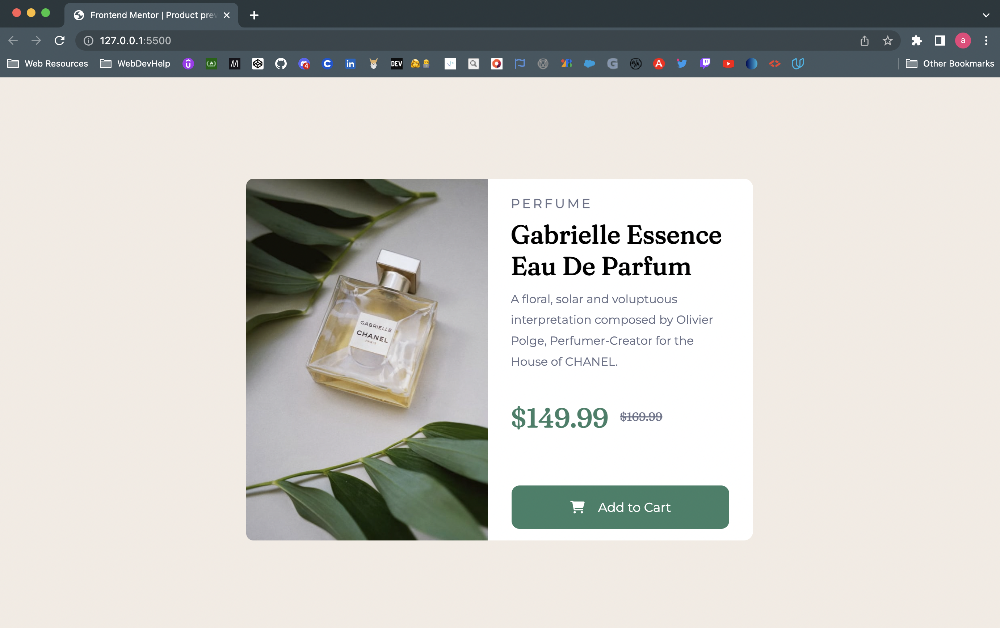

# Frontend Mentor - Product preview card component solution

This is a solution to the [Product preview card component challenge on Frontend Mentor](https://www.frontendmentor.io/challenges/product-preview-card-component-GO7UmttRfa). Frontend Mentor challenges help you improve your coding skills by building realistic projects. 

## Table of contents

- [Frontend Mentor - Product preview card component solution](#frontend-mentor---product-preview-card-component-solution)
  - [Table of contents](#table-of-contents)
  - [Overview](#overview)
    - [The challenge](#the-challenge)
    - [Screenshot](#screenshot)
    - [Links](#links)
  - [My process](#my-process)
    - [Built with](#built-with)
    - [What I learned](#what-i-learned)
    - [Continued development](#continued-development)
    - [Useful resources](#useful-resources)
  - [Author](#author)


## Overview

### The challenge

Users should be able to:

- View the optimal layout depending on their device's screen size
- See hover and focus states for interactive elements

### Screenshot





### Links

- Solution URL: [Solution URL](https://your-solution-url.com)
- Live Site URL: [Live site URL](https://alonzocodes.github.io/Product-Preview-Card/)

## My process

### Built with

- Semantic HTML5 markup
- CSS custom properties
- Flexbox
- Mobile-first workflow


### What I learned


```css
@media (min-width: ) {

}
```
Media queries helped me achieve my mobile first approach.


### Continued development

CSS Flexbox and media queries are and area I want to continue focusing on and really dive deeper into. Layouts are very important visually and mobile first is and should be first and foremost.


### Useful resources

- [resource 1](https://www.theodinproject.com/lessons/foundations-introduction-to-flexbox) - The Odin Project is one of the courses I'm currently taking and learning most from. The course offers much direction into a multitude of resources all presented in one place. 
- [resource 2](https://www.internetingishard.com/html-and-css/flexbox/) - This is another great article on Flexbox with some illustrations that help explain the code visually. 


## Author

- Website - [Alonzo Gutierrez](https://www.alonzocodes.com)
- Frontend Mentor - [@alonzocodes](https://www.frontendmentor.io/profile/alonzocodes)
- Twitter - [@alonzocodes](https://twitter.com/alonzocodes)

